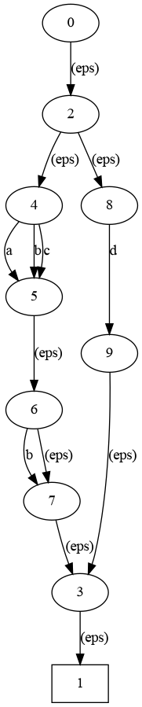
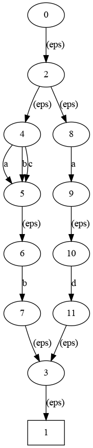
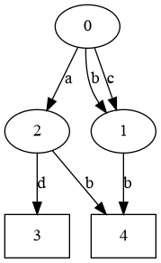
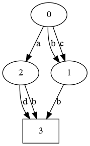

# Toy lexer

## Target: Toy Lexer
    
    $ python lexer.py 'ab abc'
    KEYWORD 'ab'
    SPACE ' '
    IDENT 'abc'
    None ''

The rules are written in `main()`, in a `(REGEX, TYPE)` fashion. For example:

    rules = (('ab|ac', 'KEYWORD'), ('[a-c]+', 'IDENT'), (' +', 'SPACE'))
    
`lexer.py` works by parsing the regexps of the rules (regexp to NFA), then convert them to DFA (NFA to DFA), then minimize them, and finally parse the input from `argv[1]`.

## Base Component: Regexp to NFA

`regex.py` draws the NFA in `regex.dot`. To see the image, you need to install graphviz.

    $ python regex.py '([a-c]b?|ad)'
    $ dot -Tpng ./regex.dot -o regex.png
    
Output:
 
   
## Component: NFA to DFA (Depends on Regexp Parser)

`nfa_to_dfa.py` draws the NFA and DFA of the regex (as specified in `argv[1]`) in `nfa.dot` and `dfa.dot`

    $ python regex.py '([a-c]b?|ad)'
    $ dot -Tpng ./nfa.dot -o nfa.png
    $ dot -Tpng ./dfa.dot -o dfa.png

NFA:
    
DFA:
    

## Component: DFA Minimizer (Depends on all the Components Above)

    $ python regex.py '([a-c]b?|ad)'
    $ dot -Tpng ./mindfa.dot -o mindfa.png

Output:
    
